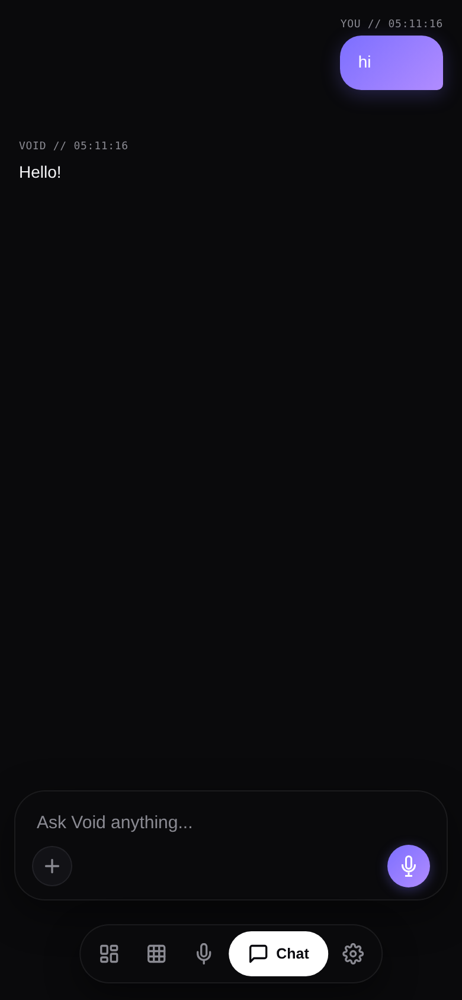
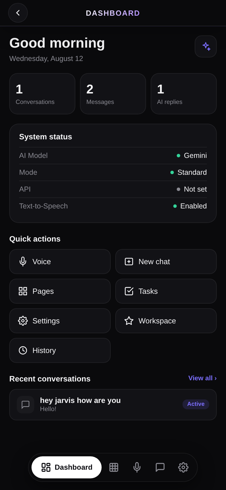
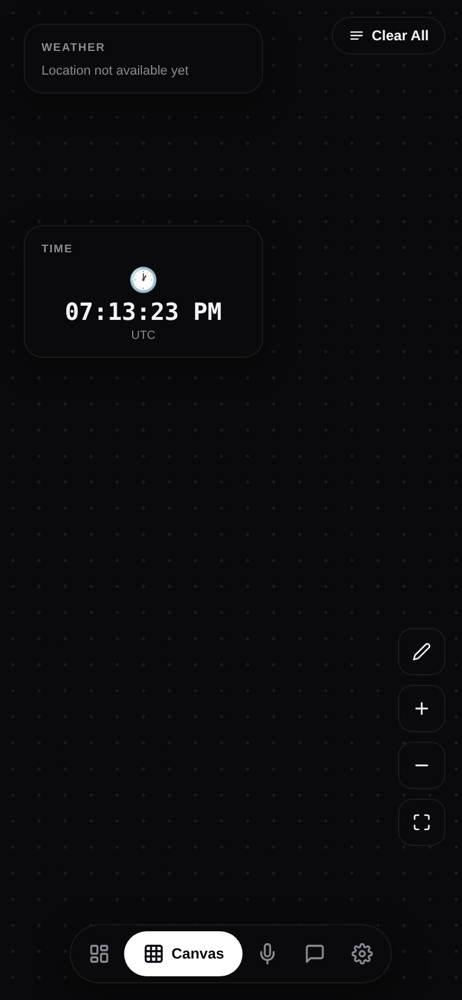
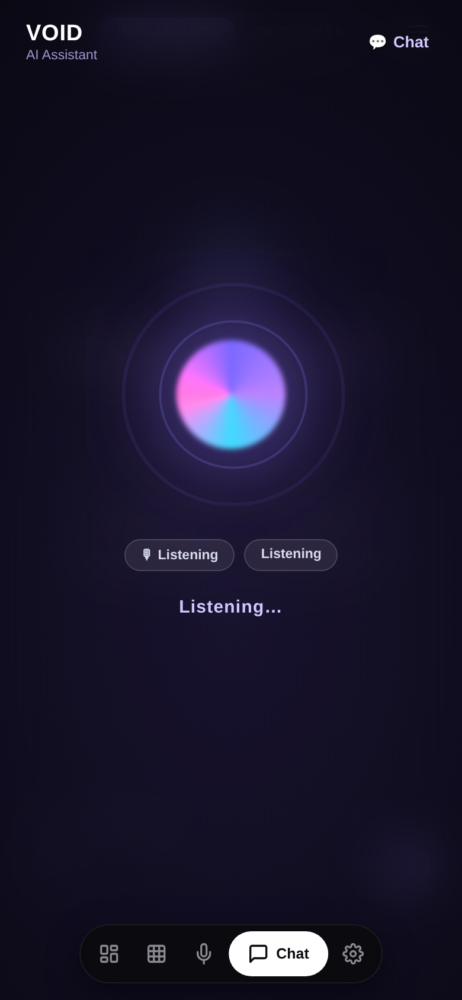

<div align="center">

# ⚡ VOID AI

**A voice-first AI assistant that lives on your phone — chats, studies, tracks your habits, and drives your device by voice.**

[](https://github.com/mh1435/void-v2/releases/tag/latest)
[](./LICENSE)
[](https://void-v2-1.onrender.com)

   

</div>

---

## What is VOID?

VOID is a PWA + native Android app built around one idea: **talk to it, and it actually does things** — not just answers questions. It's a full AI chat client, a hands-free voice assistant that works with the screen off, a study/notes workspace, a habit tracker, and — as of the latest build — a device-automation layer that can navigate, tap, scroll, and read your phone's screen on command.

Everything below is real, shipped, and running in this repo — not a roadmap.

## Table of Contents

- [Conversational AI](#-conversational-ai)
- [Voice & Wake Word](#-voice--wake-word)
- [Vision](#-vision)
- [Device Control (Accessibility)](#-device-control-accessibility)
- [Device Utilities](#-device-utilities)
- [Dashboard](#-dashboard)
- [Canvas](#-canvas)
- [Habit & Goal Tracking](#-habit--goal-tracking)
- [Pages & Study Hub](#-pages--study-hub)
- [Study Mode](#-study-mode)
- [Notifications](#-notifications)
- [More Tools](#-more-tools)
- [Personas](#-personas)
- [MLBB Game Hub](#-mlbb-game-hub)
- [Accounts, Sync & Pro](#-accounts-sync--pro)
- [Tech Stack](#tech-stack)
- [Self-Hosting](#self-hosting)

---

## 💬 Conversational AI

The core of VOID: a fast, streaming chat client routed through **VOID CORE**, a Cloudflare Worker that auto-shuffles across 13 free AI providers (Groq, Cerebras, Gemini, DeepSeek, Mistral, and more) so you never hit a rate limit. Bring your own key for Gemini, Groq, OpenRouter, Together, or Mistral and VOID falls back to it automatically if the shared core is ever busy — or just use it with **zero setup**, no key required.

- Full chat history, multiple conversations, search, rename, export, share
- Real markdown rendering — tables, lists, blockquotes, syntax-highlighted code blocks
- Context-aware memory: VOID auto-extracts and remembers facts you tell it across conversations
- Natural-language intent routing — no slash commands needed for images, documents, or device actions; just say what you want
- Multilingual — mirrors whatever language you write in

## 🎙 Voice & Wake Word

- **Speech-to-text** input with real-time recognition (native Android STT or in-browser Web Speech API)
- **Text-to-speech** replies — device voices, or a realistic cloud voice engine
- **Live voice mode** — a full hands-free back-and-forth conversation, barge-in included
- **"Okay VOID" wake word** — an always-on, fully offline background listener (Vosk speech engine) that works **even with the app closed and the screen off**. Say it anywhere and a small floating voice pill pops up — Google Assistant style — listens, replies, and speaks back, all without opening the app.
- A noise filter drops filler-word mishears ("huh", "um") so live voice mode doesn't misfire on background noise or its own echo

## 👁 Vision

- Attach a photo in chat and ask about it — VOID sees and answers using real multimodal AI, not OCR guesswork
- **Share a photo to VOID** from any app (Gallery, Camera, Chrome, etc.) via Android's native Share Sheet — it lands ready to discuss
- The wake-word voice pill can see that same shared photo too — ask "what's in this?" with the app fully closed

## 🔓 Device Control (Accessibility)

The newest and biggest capability: a full on-device automation layer, powered by a real Android Accessibility Service. Nothing here ever runs on its own — every action is a command you explicitly give, and you have to manually enable it once in **Settings → Accessibility** (Android doesn't let any app grant this to itself).

| Say this | VOID does this |
|---|---|
| "Go back" / "Go home" / "Recent apps" | Real system navigation |
| "Show notifications" / "Quick settings" | Opens the actual shade |
| "Lock my phone" / "Split screen" | System-level actions |
| "Take a screenshot" | Real screen capture, shown right in chat |
| "Scroll down" / "Swipe left" | Real touch gestures |
| "Click the submit button" | Finds it on screen by its label and taps it |
| "Long press the settings icon" | Same, but a long-press |
| "Type john@x.com into the email field" | Finds the field and fills it in |
| "What's on my screen?" | Reads every visible label and has the AI describe it in plain language |
| "Read my notifications" (optionally "from Gmail") | Lists your current notifications — needs a second, separate permission |

## 🚀 Device Utilities

Opening things has always worked, no special permission needed:
- **"Open YouTube"** → launches any installed app by fuzzy name match
- **"Open WiFi settings" / "Turn on Bluetooth"** → jumps straight to the right system settings screen
- **Paste a link, or say "open github.com"** → deep-links into the right app instead of a generic browser tab

## 🏠 Dashboard

A real home screen: today's greeting, live activity stats (conversations/messages/AI replies), system status (active AI provider, response mode, API connection, TTS), one-tap quick actions (Voice, New chat, Pages, Tasks, Workspace, History, Settings), and your recent conversations — all backed by real app state, not placeholders.

## 🖼 Canvas

A pannable, dotted-grid board for live widgets you can drag around:
- **Weather** — real data (temperature, feels-like, humidity, wind, pressure) from your actual location
- **Time** — a live-ticking clock
- Edit mode for rearranging/deleting, pinch-to-zoom-style +/− controls, and a fit-to-screen reset

## 🎯 Habit & Goal Tracking

Every project page can carry habit cards — progress rings, streaks, and a quick-log button — created entirely through natural language:

> "Track 200 pages of study daily"
> "I want to exercise 60 minutes every day"
> "Log 15 pages today"
> "Remind me at 7:30 AM"

VOID parses the goal, target, unit, and schedule out of plain speech and builds the tracker for you.

## 📚 Pages & Study Hub

A Notion-style workspace living inside VOID:
- Pages, sub-pages, and databases with custom views
- Attach a **lecture recording** (auto-transcribed), a **photo of a whiteboard/slide** (auto-OCR'd), or plain notes
- One tap turns that raw material into a **Summary**, **Cheat sheet**, **Flashcards**, or a **Quiz** — every project gets these four sections built in
- **"Make it a paper"** — VOID reorganizes the material into a real, print-ready paper: proper headings, typography, page numbers — downloadable as a PDF that preserves Unicode and RTL text perfectly (canvas-rendered, not a text-only PDF)

## 🎬 Study Mode

87 looping ambient video environments — cities, nature, space — with optional soundscapes, a live clock, and a Pomodoro timer, for focus sessions that don't feel like a blank timer app.

## 🔔 Notifications

Beyond reading them by voice/text (see Device Control above), VOID can also just quietly badge and remind you about tasks due today via its own notification system.

## 🛠 More Tools

- `/define <word>` `/price <coin>` `/image <prompt>` `/convert <amount> <from> to <to>` `/brief` `/qr <text>` — instant utility commands
- Real-time weather with auto-location detection (no typing your city)
- Wikipedia-grounded knowledge lookups — "who is X" / "what is X" pull a real summary, not a guess
- AI image generation & editing, with style presets (Realistic, Anime, 3D Render, Pixel Art, Cinematic)
- Song detection — "what song is this" identifies music playing nearby
- Document export — turn any chat or page into a `.txt`, Word, or PDF file
- GitHub integration — push code and files straight from a conversation
- Task list with due-date reminders and a daily briefing command
- Floating assistant overlay — a small always-on-top bubble accessible from any app

## 🎭 Personas

Reshape how VOID responds with one tap: **Default**, **Tutor** (guides you to the answer instead of giving it away), **Coder** (technical, code-first), **Translator**, **Listener** (warm, supportive), **Roast** (playfully savage).

## 🎮 MLBB Game Hub

Mobile Legends: Bang Bang hero guides, item builds, counters, and meta — AI-powered, only surfaces when you actually ask about it.

## 👤 Accounts, Sync & Pro

Multi-device sync, theming (dark, light, cream, paper, soft gray, matrix, and more, each with a Liquid/Frozen glass style), and **VOID Pro** — a subscription unlocking unlimited chats, all study locations, and every theme, via Stripe (cards worldwide, Apple Pay, Google Pay).

---

## Tech Stack

| Layer | What |
|---|---|
| Frontend | Vanilla JS, HTML, CSS — no framework |
| Hosting | [Render](https://render.com) — auto-deploys from `main` |
| AI Router | Cloudflare Worker (`void-proxy`) — shuffles 13 providers, keys in secrets only |
| Payments | Stripe — subscriptions, worldwide cards |
| Plan storage | Cloudflare KV (`PLANS` namespace) |
| Android | Capacitor — loads the live URL, auto-updates when the web app updates |
| Native automation | A real Android `AccessibilityService` + `NotificationListenerService` |
| Wake word | Vosk (fully offline speech recognition), running as a foreground service |
| CI | GitHub Actions — auto-builds and publishes the APK on every push to `main` |

## Self-Hosting

### 1. Fork & Deploy to Render
1. Fork this repo
2. Connect to [Render](https://render.com) → New Static Site → point to your fork
3. No build command needed — deploys from root
4. Auto-deploys on every push to `main`

### 2. Cloudflare Worker (AI Router)
```bash
cd worker
npx wrangler deploy
```
Add your AI provider keys as **Secrets** in Cloudflare Dashboard → Workers → void-proxy → Settings → Variables.

Keys: `GROQ_KEY`, `CEREBRAS_KEY`, `SAMBANOVA_KEY`, `DEEPSEEK_KEY`, `OPENROUTER_KEY`, `TOGETHER_KEY`, `FIREWORKS_KEY`, `NVIDIA_KEY`, `HYPERBOLIC_KEY`, `HF_TOKEN`, `MISTRAL_KEY`, `COHERE_KEY`, `GEMINI_KEY`

### 3. Payments (optional)
See [PAYMENTS_SETUP.md](PAYMENTS_SETUP.md) for full Stripe setup.

Secrets to add to Cloudflare Worker:
```
STRIPE_SECRET_KEY       sk_live_…
STRIPE_WEBHOOK_SECRET   whsec_…
STRIPE_PRICE_PRO        price_…
STRIPE_PRICE_MAX        price_…
```

### 4. Android APK
The APK points to your live Render URL — it auto-updates whenever the web app updates, no reinstall needed for JS/HTML/CSS changes. Native changes (Java) do need a rebuild.

**Fastest way:** every push to `main` auto-builds and publishes an APK via GitHub Actions — grab it from the [latest release](https://github.com/mh1435/void-v2/releases/tag/latest).

To build locally:
```bash
npm install
npx cap sync android
cd android && ./gradlew assembleDebug
```
Output: `android/app/build/outputs/apk/debug/app-debug.apk`

**Note on Device Control:** after installing, "VOID Device Control" and "VOID" (notification access) need to be manually enabled in **Settings → Accessibility** and **Settings → Notification access** — Android requires this to be a deliberate, manual step for any app. VOID opens the right settings screen for you the first time you try a command that needs it.

## Security

All API keys and secrets live **only in Cloudflare Worker secrets** — never in code or this repo. Users can never see them.

## License

All Rights Reserved. This is proprietary, closed-source software — no
license is granted to use, copy, modify, or redistribute it. See [LICENSE](./LICENSE).
